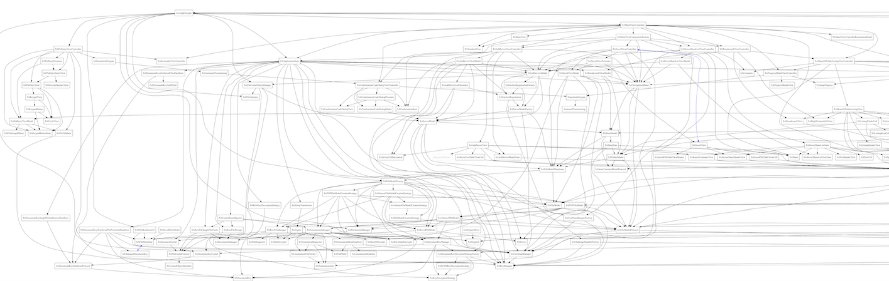

# Practical Graphviz
+++
# Questions?
* You are not alone
* Other people will have the same questions
---
## Who is this guy?
* Org chart
* Family
* Tech
+++
## Org Chart
@plantuml[drop=left, pad=30px, width=1000px](puml/org.puml)
+++
@plantuml[drop=center, pad=30px, width=1000px](puml/family.puml)
+++
@plantuml[drop=center, pad=30px, width=1000px](puml/tech.puml)
---
## Practical Graphviz?
* Graphviz
* Practical
+++
@plantuml[drop=center, pad=30px, width=1000px](puml/graphviz.puml)
+++
@plantuml[drop=center, pad=30px, width=1000px](puml/graph.puml)
+++
@plantuml[drop=center, pad=30px, width=1000px](puml/digraph.puml)
+++
@plantuml[drop=center, pad=30px, width=1000px](puml/whiteboard.puml)
+++
## Editors
* xdot
* Atom
  - [graphviz-preview-plus](https://atom.io/packages/graphviz-preview-plus)
  - invoke via ctrl-shift-G
* Visual Studio Code
  - [graphviz-preview](https://marketplace.visualstudio.com/items?itemName=EFanZh.graphviz-preview)
  - invoke via Ctrl + Shift + P Graphviz
* [Graphviz Online](https://dreampuf.github.io/GraphvizOnline)

+++
@plantuml[drop=center, pad=30px, width=1000px](puml/practical.puml)
+++
## Benefits of Source Code
* Source Control
* Easier Merges
* Email
* Pipeline (plays well with tools that process text)
---
## Workflows
* Whiteboard
* Existing tool
* tree -> pipeline -> editor -> graphviz -> output
+++
@plantuml[drop=center, pad=30px, width=1500px](puml/workflow.puml)
---
## Pipeline tools
* grep
* sed
* all the standard command line tools
* a language built for this stuff : awk, perl
* a language that can be adapted to this : groovy
+++
@plantuml[drop=center, pad=30px, width=1000px](puml/grep.puml)
+++
@plantuml[drop=center, pad=30px, width=1000px](puml/sed.puml)
+++
@plantuml[drop=center, pad=30px, width=1000px](puml/groovy.puml)
---
## [Dot language](https://graphviz.org/doc/info/lang.html)
* graphs
* digraphs
* subgraphs
* shapes
* labels
* colors
+++
@plantuml[drop=center, pad=30px, width=1000px](puml/color.puml)
+++
@plantuml[drop=center, pad=30px, width=1000px](puml/shapes.puml)
+++
@plantuml[drop=center, pad=30px, width=1000px](puml/arrows.puml)
+++
@plantuml[drop=center, pad=30px, width=1000px](puml/subgraph.puml)
---
## Language Examples
* [Go](https://graphviz.org/Gallery/directed/go-package.html)
* Objective C
* Dart
* C#
* Java
* [Groovy](https://dreampuf.github.io/GraphvizOnline/?url=https://raw.githubusercontent.com/curtcox/Meraki-Web-Gateway/master/architecture/gateway.dot)
* TypeScript
* Your favorite language, too
+++
@plantuml[drop=center, pad=30px, width=1800px](puml/go.puml)
+++

+++
# Visual Structural Analysis
* High level structures can be identified
* Using them can clarify and simplify
+++
@code[bash](dart_structure.sh)
---
## Examples
* [Meraki Web Gateway](https://github.com/curtcox/Meraki-Web-Gateway)
* Recipe
+++
@plantuml[drop=center, pad=30px, width=1800px](puml/pipeline.puml)
+++
@plantuml[drop=center, pad=30px, width=1500px](puml/packages.puml)
+++
@plantuml[drop=center, pad=30px, width=1500px](puml/gateway.puml)
+++
## Repo Examples
* Maven
* Scala / SBT [sbt-dependency-graph](https://github.com/sbt/sbt-dependency-graph)
* Cocoapods
+++
* sbt-dependency-graph
  - addSbtPlugin("net.virtual-void" % "sbt-dependency-graph" % "0.10.0-RC1")
  - dependencyDot: Generates a .dot file with the project's dependencies
  - Use graphviz to render it to your preferred graphic format
+++
@plantuml[drop=center, pad=30px, width=1500px](puml/network.puml)
+++
@plantuml[drop=center, width=1700px](puml/recipe.puml)
+++
# Where does it go?
* Graphviz files are easily used as one more step.
* Where does the cable go?
* Where does the ingredient go?
* Where does the library go?
+++
---
## Embedded Links
@plantuml[drop=center, pad=30px, width=1000px](puml/links.puml)
---
## Output formats
* PNG
* PDF
* SVG
---
## Escape Hatches
* SVG
* HTML
* API
  - easy access to coordinates
  - several tools use Graphviz as a layout engine
---
## Online
* http://viz-js.com/
* https://edotor.net/
* http://www.webgraphviz.com/
* http://graphviz.it/#/gallery/clust1.gv
* https://stamm-wilbrandt.de/GraphvizFiddle/
* https://dreampuf.github.io/GraphvizOnline/
---
## Platform specific installs
* Use your package manager
* https://graphviz.org/download/
---
## Also
* [Mermaid](https://mermaid-js.github.io/mermaid/#/)
* [Live Editor](https://mermaid-js.github.io/mermaid-live-editor)
* Mermaid vs Graphviz (that's another talk)
---
# Questions
---
# How have you used Graphviz?
---
