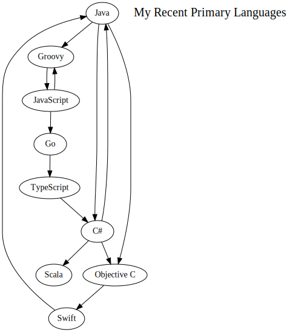
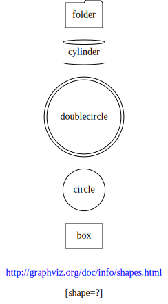
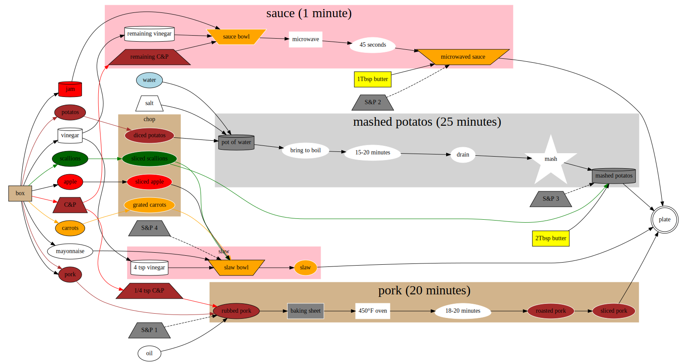

# Practical Graphviz
---
# Questions?
---
## Who is this guy?
* Org chart
* Family
* Tech
---
## Org Chart

---

---
# Tech

---
## Practical Graphviz?
* Graphviz
* Practical
---

---

---

---
## Editors
* xdot
* Atom
  - [graphviz-preview-plus](https://atom.io/packages/graphviz-preview-plus)
  - invoke via ctrl-shift-G
* Visual Studio Code
  - [graphviz-preview](https://marketplace.visualstudio.com/items?itemName=EFanZh.graphviz-preview)
  - invoke via Ctrl + Shift + P Graphviz
* [Graphviz Online](https://dreampuf.github.io/GraphvizOnline)

---

---
## Benefits of Source Code
* Source Control
* Easier Merges
* Email
* Pipeline
---
## Workflows
* Whiteboard
* Adhoc online
* Existing tool
* tree -> pipeline -> editor -> graphviz -> output
---

---
## Pipeline tools
* grep
* awk
* sed
* groovy
---
## [Dot language](https://graphviz.org/doc/info/lang.html)
* graphs
* digraphs
* subgraphs
* shapes
* labels
* colors
---

---

---

---
## Output formats
* PNG
* PDF
* SVG
---
## Language Examples
* Scala
* Dart
* [Go](https://graphviz.org/Gallery/directed/go-package.html)
* C#
* Java
* [Groovy](https://dreampuf.github.io/GraphvizOnline/?url=https://raw.githubusercontent.com/curtcox/Meraki-Web-Gateway/master/architecture/gateway.dot)
* Objective C
---
## Repo Examples
* Scala
* Cocoapods
---
## Examples
* [Meraki Web Gateway](https://github.com/curtcox/Meraki-Web-Gateway)
* Recipe
---

---

---

---

---
## Embedded Links

---

---
## Escape Hatches
* SVG
* HTML
* API
---
## Online
* http://viz-js.com/
* https://edotor.net/
* http://www.webgraphviz.com/
* http://graphviz.it/#/gallery/clust1.gv
* https://stamm-wilbrandt.de/GraphvizFiddle/
* https://dreampuf.github.io/GraphvizOnline/
---
## Platform specific installs
* Use your package manager
* https://graphviz.org/download/
---
## Also
* [Mermaid](https://mermaid-js.github.io/mermaid/#/)
* [Live Editor](https://mermaid-js.github.io/mermaid-live-editor)
* Mermaid vs Graphviz
---
# Questions
---
# How have you used Graphviz?
---
